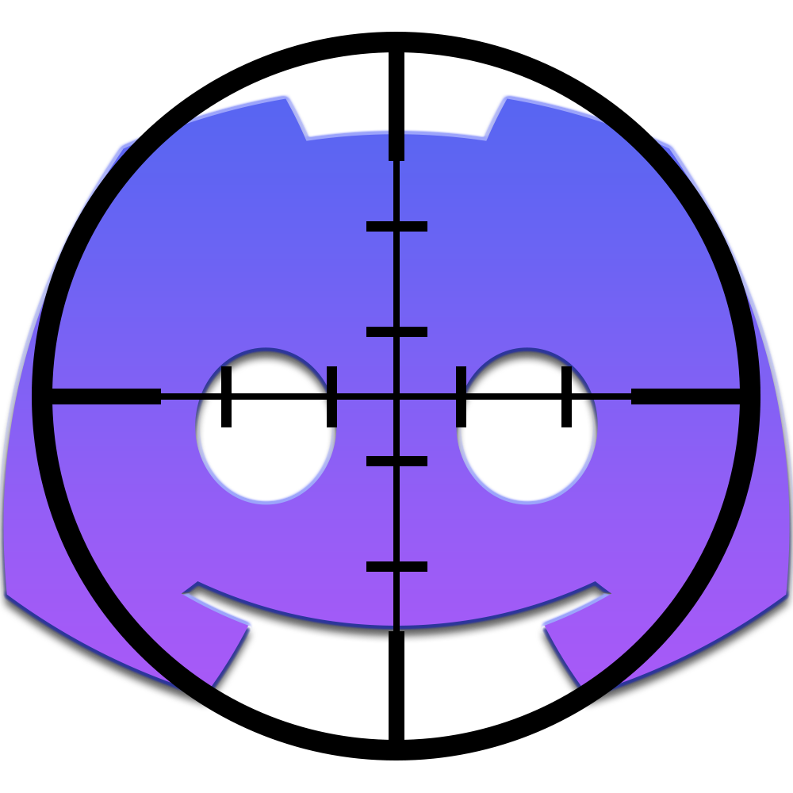

<h1 align="center">
    
    <br/>
    <b>CrossCord</b>
</h1>

<p align="center">
    An anticheat friendly crosshair that uses Discord's overlay
    <br/>
    <a href="https://github.com/neeeruuu/crosscord/releases/latest"><b>Download</b></a>
    <br/>
    <br/>
    <i>Inspired by <a href="https://github.com/SamuelTulach">SamuelTulach</a>'s overlay proof of concept</i>
</p>


# Usage
1. Enable Discord's overlay
2. Open CrossCord
3. The moment Discord draws its overlay on a game, a crosshair will be drawn

# To-do
- [x] Basic crosshair types (cross, triangle, circle)
- [x] UI
- [x] Tray icon
- [x] Persistent settings
- [x] Icon
- [x] Image crosshairs
- [x] Improve render consistency
- [ ] Improve comments
- [ ] Outlines
- [ ] Framebuffer write callbacks instead of loop thread (possibly using PAGE_GUARD)
- [ ] Keybinds
- [ ] Refactor image rendering

# Building
### Requirements
* CMake
* Visual Studio

### Steps
1. Clone the repo ````
git clone https://github.com/neeeruuu/crosscord --recurse-submodules````
2. Open repo's folder
3. Run GenProj.bat (or open on VS Code and press Ctrl+Shift+B)
4. Open solution proj folder (crosscord.sln)
5. Build
